# EAP DE GESTÃO DO PROJETO — PADRÃO PMI/PMBOK

## TCC Inteligent-Juridico

| Campo | Definição |
|---|---|
| Projeto | Inteligent-Juridico |
| Instituição | Centro Universitário de Brasília — CEUB/UniCEUB |
| Curso | Bacharelado em Ciência da Computação |
| Natureza | Trabalho de Conclusão de Curso — projeto aplicado |
| Tipo de EAP | Orientada a entregas |
| Versão | 1.0 |
| Responsável | [NOME DO(A) ALUNO(A)] |
| Orientador(a) | [NOME DO(A) ORIENTADOR(A)] |

> Esta EAP representa 100% do escopo do projeto acadêmico. Atividades detalhadas, durações e dependências deverão ser derivadas posteriormente para o cronograma.

# 1. Princípios adotados

A estrutura segue os princípios do PMI para uma Work Breakdown Structure:

- decomposição hierárquica orientada a entregas;
- aplicação da regra dos 100%;
- inclusão de entregas externas, internas e intermediárias;
- inclusão do trabalho de gerenciamento;
- ausência de sobreposição de escopo entre elementos irmãos;
- decomposição até pacotes que possam ser estimados, atribuídos, acompanhados e aceitos;
- códigos únicos para rastreabilidade;
- uso de substantivos para representar resultados, e não listas de ações.

# 2. Escopo da EAP do projeto

Esta EAP abrange:

- governança do TCC;
- planejamento e controle;
- pesquisa e metodologia;
- especificação do produto;
- construção do protótipo limitado;
- verificação e avaliação;
- produção acadêmica;
- encerramento e defesa.

Ela não substitui:

- cronograma;
- backlog do produto;
- quadro Kanban;
- matriz de responsabilidades;
- registro de riscos;
- EAP técnica do produto.

# 3. Diagrama da EAP do projeto

```mermaid
flowchart TB
    P["1.0 Projeto TCC Inteligent-Juridico"]
    P --> G["1.1 Governança do projeto"]
    P --> PL["1.2 Linha de base do planejamento"]
    P --> R["1.3 Pesquisa acadêmica"]
    P --> M["1.4 Solução especificada"]
    P --> A["1.5 Protótipo Inteligent-Juridico"]
    P --> Q["1.6 Qualidade e avaliação"]
    P --> T["1.7 Trabalho acadêmico"]
    P --> E["1.8 Encerramento e defesa"]

    G --> G1["Termo de abertura"]
    G --> G2["Governança e comunicação"]
    G --> G3["Registros de decisão e mudança"]

    PL --> PL1["Linha de base do escopo"]
    PL --> PL2["Cronograma e recursos"]
    PL --> PL3["Riscos, qualidade e aquisições"]

    R --> R1["Referencial teórico"]
    R --> R2["Investigação do problema"]
    R --> R3["Metodologia de avaliação"]

    M --> M1["Requisitos priorizados"]
    M --> M2["Arquitetura e dados"]
    M --> M3["Segurança, IA e UX"]

    A --> A1["Fundação técnica"]
    A --> A2["Jornada cognitiva mínima"]
    A --> A3["Componente de IA"]

    Q --> Q1["Evidências de teste"]
    Q --> Q2["Avaliação de usabilidade e IA"]
    Q --> Q3["Resultados analisados"]

    T --> T1["Monografia"]
    T --> T2["Referências e normalização"]
    T --> T3["Apêndices técnicos"]

    E --> E1["Pacote final de entrega"]
    E --> E2["Apresentação e demonstração"]
    E --> E3["Aceite e lições aprendidas"]
```



# 4. Estrutura hierárquica codificada

```text
1.0 PROJETO TCC INTELIGENT-JURIDICO
│
├── 1.1 Governança do projeto
│   ├── 1.1.1 Termo de abertura aprovado
│   ├── 1.1.2 Estrutura de governança e comunicação
│   ├── 1.1.3 Registro de stakeholders
│   ├── 1.1.4 Registro de decisões
│   ├── 1.1.5 Controle integrado de mudanças
│   └── 1.1.6 Relatórios de acompanhamento
│
├── 1.2 Linha de base do planejamento
│   ├── 1.2.1 Declaração do escopo
│   ├── 1.2.2 EAP e dicionário da EAP
│   ├── 1.2.3 Cronograma de referência
│   ├── 1.2.4 Estimativa de esforço e recursos
│   ├── 1.2.5 Plano de qualidade
│   ├── 1.2.6 Registro de riscos e respostas
│   ├── 1.2.7 Plano de comunicação
│   └── 1.2.8 Estratégia de configuração e versões
│
├── 1.3 Pesquisa acadêmica
│   ├── 1.3.1 Protocolo da revisão bibliográfica
│   ├── 1.3.2 Referencial sobre legaltech e sistemas jurídicos
│   ├── 1.3.3 Referencial sobre arquitetura e multi-tenancy
│   ├── 1.3.4 Referencial sobre UX e carga cognitiva
│   ├── 1.3.5 Referencial sobre IA generativa e RAG
│   ├── 1.3.6 Referencial sobre segurança, ética e LGPD
│   ├── 1.3.7 Instrumento de investigação
│   ├── 1.3.8 Evidências da investigação
│   └── 1.3.9 Síntese do problema e das hipóteses
│
├── 1.4 Solução especificada
│   ├── 1.4.1 Personas e jornada de referência
│   ├── 1.4.2 Requisitos funcionais priorizados
│   ├── 1.4.3 Requisitos não funcionais priorizados
│   ├── 1.4.4 Casos de uso e critérios de aceitação
│   ├── 1.4.5 Arquitetura lógica
│   ├── 1.4.6 Modelo de domínio
│   ├── 1.4.7 Modelo de dados normalizado
│   ├── 1.4.8 Modelo de segurança e privacidade
│   ├── 1.4.9 Modelo de governança da IA
│   └── 1.4.10 Protótipo de interface
│
├── 1.5 Protótipo Inteligent-Juridico
│   ├── 1.5.1 Fundação técnica executável
│   ├── 1.5.2 Identidade e isolamento multi-tenant
│   ├── 1.5.3 Domínio jurídico mínimo
│   ├── 1.5.4 Legal Mission Control
│   ├── 1.5.5 Client & Matter Cockpit
│   ├── 1.5.6 Legal Decision Workspace
│   ├── 1.5.7 IA contextual com fontes
│   ├── 1.5.8 Auditoria e rastreabilidade
│   └── 1.5.9 Ambiente de demonstração
│
├── 1.6 Qualidade e avaliação
│   ├── 1.6.1 Plano e matriz de testes
│   ├── 1.6.2 Evidências unitárias e de integração
│   ├── 1.6.3 Evidências de jornada ponta a ponta
│   ├── 1.6.4 Evidências de isolamento e autorização
│   ├── 1.6.5 Avaliação das respostas de IA
│   ├── 1.6.6 Avaliação de usabilidade
│   ├── 1.6.7 Medições de desempenho
│   └── 1.6.8 Relatório de resultados e limitações
│
├── 1.7 Trabalho acadêmico
│   ├── 1.7.1 Introdução
│   ├── 1.7.2 Fundamentação teórica
│   ├── 1.7.3 Metodologia
│   ├── 1.7.4 Análise e especificação
│   ├── 1.7.5 Projeto e implementação
│   ├── 1.7.6 Avaliação e resultados
│   ├── 1.7.7 Conclusão
│   ├── 1.7.8 Referências normalizadas
│   └── 1.7.9 Apêndices e anexos
│
└── 1.8 Encerramento e defesa
    ├── 1.8.1 Versão final revisada
    ├── 1.8.2 Repositório e documentação final
    ├── 1.8.3 Pacote de evidências
    ├── 1.8.4 Apresentação de slides
    ├── 1.8.5 Roteiro de demonstração
    ├── 1.8.6 Ensaio da defesa
    ├── 1.8.7 Entrega institucional
    ├── 1.8.8 Defesa perante a banca
    └── 1.8.9 Lições aprendidas e encerramento
```

# 5. Contas de controle

| Conta | Responsabilidade de controle | Evidência principal |
|---|---|---|
| CC-01 — Governança | Escopo, decisões, comunicação e mudanças | Termo, atas, decisões e relatórios |
| CC-02 — Planejamento | Linhas de base e planos auxiliares | EAP, cronograma, riscos e qualidade |
| CC-03 — Pesquisa | Rigor acadêmico e validade do problema | Referências, protocolo e evidências |
| CC-04 — Especificação | Rastreabilidade entre problema e solução | Requisitos, modelos e protótipos |
| CC-05 — Produto | Construção do protótipo limitado | Código, migrations e demonstração |
| CC-06 — Qualidade | Verificação e avaliação | Testes, métricas e resultados |
| CC-07 — Monografia | Comunicação científica | Texto revisado e referências |
| CC-08 — Encerramento | Entrega e aceite | Pacote final e defesa |

# 6. Dicionário dos pacotes de trabalho

| Código | Pacote de trabalho | Resultado verificável | Critério de aceite | Responsável |
|---|---|---|---|---|
| 1.1.1 | Termo de abertura aprovado | Projeto formalmente definido | Tema, problema, objetivo, limites e orientador identificados | Aluno/orientador |
| 1.2.2 | EAP e dicionário | Linha de base do escopo | Regra dos 100%, códigos e pacotes aceitos | Aluno/orientador |
| 1.2.3 | Cronograma de referência | Sequência, marcos e reservas | Compatível com o calendário acadêmico | Aluno/orientador |
| 1.3.1 | Protocolo bibliográfico | Estratégia de busca e seleção | Bases, descritores e critérios registrados | Aluno |
| 1.3.8 | Evidências da investigação | Dados exploratórios tratados | Coleta ética ou contingência metodológica documentada | Aluno/orientador |
| 1.4.4 | Casos de uso e aceite | Escopo testável | Cada requisito Must associado a cenário de aceite | Aluno |
| 1.4.7 | Modelo de dados | Esquema normalizado | Entidades, relações, restrições e tenant definidos | Aluno |
| 1.4.8 | Modelo de segurança | Regras de acesso e ameaça | Tenant, papel, vínculo, auditoria e riscos modelados | Aluno |
| 1.5.1 | Fundação executável | Aplicação e banco inicializados | Execução reproduzível por instruções documentadas | Aluno |
| 1.5.2 | Isolamento multi-tenant | Dois escritórios fictícios segregados | Teste cruzado bloqueado | Aluno |
| 1.5.4 | Mission Control | Missões priorizadas e explicadas | Exibe motivo, origem e próxima ação | Aluno |
| 1.5.5 | Cockpit | Contexto consolidado do assunto | Dados autorizados em uma visão coerente | Aluno |
| 1.5.6 | Decision Workspace | Decisão delimitada e registrada | Jornada concluída com confirmação humana | Aluno |
| 1.5.7 | IA contextual | Resposta ou resumo fundamentado | Fonte exibida ou insuficiência declarada | Aluno |
| 1.5.8 | Auditoria | Registro de ações críticas | Autor, ação, horário e correlação preservados | Aluno |
| 1.6.4 | Evidências de isolamento | Resultado de testes negativos | Nenhum acesso indevido aceito | Aluno |
| 1.6.5 | Avaliação de IA | Métricas e casos avaliados | Fidelidade, fontes, recusas e limitações registradas | Aluno |
| 1.6.8 | Relatório de resultados | Hipóteses confrontadas com evidências | Resultados reproduzíveis e limitações explícitas | Aluno/orientador |
| 1.7.1–1.7.9 | Trabalho acadêmico | Documento completo | Formato e conteúdo aprovados pelo orientador | Aluno/orientador |
| 1.8.1–1.8.8 | Entrega e defesa | Pacote submetido e apresentado | Requisitos institucionais cumpridos | Aluno |

# 7. Critérios de linha de base

A EAP poderá se tornar linha de base quando:

1. cobrir 100% do escopo aprovado;
2. não incluir entregas da plataforma comercial futura;
3. possuir pacotes estimáveis e verificáveis;
4. explicitar critérios de aceite;
5. estar alinhada ao calendário do TCC;
6. ser aprovada pelo aluno e orientador.

Depois da aprovação, alterações deverão ser registradas contendo solicitação, justificativa, impacto em escopo, prazo, qualidade e riscos, decisão e atualização de versão.

# 8. Exclusões do projeto

- produto jurídico completo para produção;
- integração real com tribunais;
- operação com dados jurídicos sigilosos;
- financeiro, CRM completo e assinatura real;
- aplicativo móvel;
- marketplace e agentes autônomos;
- arquitetura distribuída de produção;
- certificações e SLA comercial.

# 9. Referências PMI

- [Practice Standard for Work Breakdown Structures — Third Edition](https://www.pmi.org/standards/work-breakdown-structures-third-edition).
- [PMI: conceito e aplicação de Work Breakdown Structures](https://www.pmi.org/learning/library/practice-standard-work-breakdown-structures-8063).
- [PMI: características de uma EAP efetiva](https://www.pmi.org/learning/library/2019/04/07/15/35/creating-effective-wbs-recognize-quality-7541).

